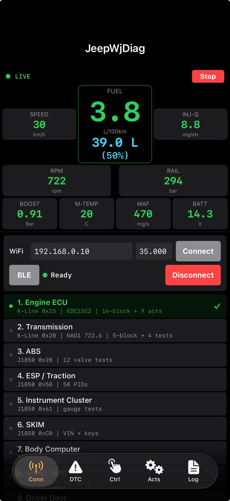
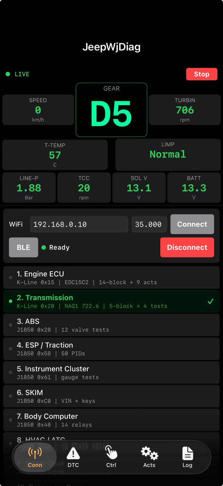

# WJDiag — Jeep Grand Cherokee WJ 2.7 CRD Diagnostic Tool

## Vehicle: 2003 EU-spec WJ 2.7 CRD (OM612 / NAG1)

Qt6 cross-platform diagnostic application + native iOS (Swift/SwiftUI) port + ESP32-S3 ELM327 emulator.
All commands and responses verified on real vehicle via BLE full block dumps and bus capture analysis.

## Repository layout

| Folder | Contents |
|---|---|
| `ios-app/JeepWJDiag/` | Native iOS app (Swift/SwiftUI, Xcode project) — the version used on the car |
| `qt-app/` | Qt6 C++ desktop/mobile app (`JeepWJDiag.pro`, `src/`, `include/`, Android/iOS/macOS packaging) |
| `esp32-emulator/` | ESP32-S3 ELM327 emulator (PlatformIO) with real-vehicle response database and smoke-test engine model |
| `captures/pcap/` | Real-vehicle bus captures (ECU live, TCM live, all modules) — the ground truth for block layouts |
| `ecu-firmware/` | EDC15C2 flash dumps (`293-822` = this car, stock; `293-822-egr-off` = EGR-off; `293-822-EGR-OFF-BOOST` = currently flashed: EGR-off + eco driver wish + launch boost target + launch fuel, checksum fixed; `409-438` = 2004 reference) and `293-822_maps.md` (extracted maps + applied-changes log) |
| `docs/` | `RELAY_MAP.md` (full command / block reference), OBD-II pinout, screenshots; `STATUS.md` = current project status / what is flashed / pending work — read this first |
| `assets/` | App icons and splash images |
| `tools/` | Auxiliary tools (EcuParser) |

`WJKEY.keystore` (Android signing key) is kept locally and is no longer tracked.

## iOS / Xcode Version (Swift/SwiftUI)

Native iOS port targeting iPhone (iOS 17+). Source code: `ios-app/JeepWJDiag/`

### Screenshots

| ECU Live Data | TCM Live Data |
|:---:|:---:|
|  |  |

### Features
- **5 tabs**: Conn (connection + dashboard + module list), DTC, Ctrl (quick controls), Acts (actuators), Log
- **ECU Dashboard**: Big FUEL center (L/h stopped, L/100km driving + fuel level liters), SPEED, RPM, RAIL, BOOST, M-TEMP, MAF, BATT
- **TCM Dashboard**: Big GEAR center (D1-D5 green, P/N/R amber, LIMP red), SPEED, TURBIN, T-TEMP, LIMP, LINE-P, TCC, SOL V, BATT
- **Actuator controls**: Hold-to-activate buttons with green highlight for all modules
- **Quick Controls tab**: Driver Door / Passenger Door / BCM quick-access grid
- **Smoke Test** (Acts tab, top card): high-rate recording of pedal, fuel qty (0x28/0x32), MAF (0x36), boost actual vs setpoint (0x12/0x36), rail (0x12), IAT, 0x21 fuel-limiter words, 0x37/0x20/0x23 raw words during a full-throttle transient. Cycle is 0x36 → 0x28 → one slow block (0x12 every other slot, 0x26 vehicle speed interleaved every ~1.6 s for 0-60/80/100 km/h timing, then 0x21/0x32/0x37/0x20/0x23); real-car reads take ~250-300 ms each (captures/pcap/ecu_live.pcap), so the test sets `ATAT2` + `ATST 19` after init and keeps the cycle at 3 reads (~0.8 s, fuel/pedal/MAF every cycle). MARK button tags the moment smoke is seen. Auto summary (A/F per stroke, boost lag/deficit, MAF vs theoretical air, rail dip, idle-only corrections, adapter stall gaps) + CSV (with gear and the 0x36[0-1] signed word), shared to WhatsApp (text) or via share sheet (file). Pulls are detected from the pedal word 0x36/0x12[12-13] (clamped 0–100 %); rail is judged only while fuel is injected (overrun sits at ~500 bar, which is normal). After the test the ECU stays selected and SID 81 keepalive continues, otherwise the K-Line session and the WiFi adapter's TCP socket drop within ~20 s.
- **BLE auto-connect**: Background scan with OBD device filter list
- **Manual Start/Stop Live Data**: Live data does not auto-start — allows actuator use first
- **Launch screen**: Composite splash image with JeepWjDiag title + Jeep photo
- **Real-bus robustness** (derived from `captures/captures/pcap/*.pcap`): J1850 replies are kept only when they start with `26 <addr>` (drops `2D xx`, `B8 58`, `23 A0` traffic); NRC detection is token based (`7F sid code`), so data bytes 7F/21/78 never trigger a retry; module probe retries once on `NO DATA` (9 of 30 first reads after `ATRA` fail on the car); TCM `14 00 00` handles `7F 14 78` by waiting and re-reading for the deferred `54`; ESP `01 00 00` clear retries up to 10×; DTC PID scan locates `26 <addr> 62` and treats `xx FF FF` as unsupported.

---

## Protocol & Init Sequences (Verified)

### J1850 VPW Init
```
ATZ → ATZ → ATSP2 → ATIFR0 → ATH1 → ATSH24xx22 → ATRAxx
```
Double ATZ for clone ELM327 reliability. ATE1 not sent (echo stays on from ATZ default).
ATH1 comes AFTER ATSP2/ATIFR0, not before.

### K-Line ECU Init (0x15)
```
ATZ → ATE1 → ATH1 → ATWM8115F13E → ATSH8115F1 → ATSP5 → ATFI → 81 → 27 01/02
```
ATFI sends two-part response: `BUS INIT:\r` + 200ms delay + `OK\r\r>`.

### K-Line TCM Init (0x20)
```
ATZ → ATE1 → ATH1 → ATWM8120F13E → ATWM8120F13E → ATSH8120F1 → ATSP5 → ATFI → 81 → 27 01/02
```
Double ATWM for TCM reliability. First `81` can also trigger `BUS INIT: OK` on ELM327
(alternative to ATFI for bus initialization).

### Keepalive
SID `81` (StartCommunication) is used as K-Line keepalive, NOT `3E` (TesterPresent).
ECU responds with `C1 EF 8F` each time.

### ECU Security — Seed=0x0000 Handling
When ECU is already unlocked, it returns seed `67 01 00 00`. This means security is inactive.
**Do not send a key in this state**: the real ECU answers `27 02 9C C9` (ArvutaKoodi of seed 0)
with NRC `7F 27 12` (captures/pcap/full_modules.pcap, 3 attempts). Both apps and the emulator skip the key.
Blocks 0x62/0xB0/0xB1/0xB2 are readable without explicit security unlock when seed=0.

## Complete Module Address Map (Verified)

| # | Addr | Bus | Module | Real Vehicle Response |
|---|------|-----|--------|----------------------|
| 1 | 0x15 | K-Line | Engine ECU (Bosch EDC15C2 OM612) | OK — 9 actuators + 14-block live data |
| 2 | 0x20 | K-Line | Transmission (NAG1 722.6) | OK — 4 tests + 5-block live data |
| 3 | 0x28 | J1850 | ABS | OK — read + 12 valve tests + DTC |
| 4 | 0x58 | J1850 | ESP / Traction Control | OK — read + 50 live PIDs. DTC clear: NO DATA |
| 5 | 0x61 | J1850 | Instrument Cluster | OK — 11 LED + gauge tests (SID 0x3A) |
| 6 | 0xC0 | J1850 | SKIM / Immobilizer | OK — reset + VIN + key program |
| 7 | 0x40 | J1850 | Body Computer | OK — 14 relays + mode 0xB4 config |
| 8 | 0x98 | J1850 | HVAC / ATC / Memory Seat | OK — 10 motor tests |
| 9 | 0xA0 | J1850 | Driver Door (left windows) | OK — 16 actuators |
| 10 | 0xA1 | J1850 | Passenger Door (right windows) | OK — 15 actuators + RKE |
| 11 | 0x60 | J1850 | Electro Mech Cluster | NRC 7F 22 22 on all commands |
| 12 | 0x68 | J1850 | Overhead Console | OK — self test + reset |
| 13 | 0x6D | J1850 | Navigation | `62 00 00 00` on all reads |
| 14 | 0x80 | J1850 | Radio | NO DATA |
| 15 | 0x81 | J1850 | CD Changer | `62 00 00 00` on all reads |
| 16 | 0x62 | J1850 | Park Assist | `62 00 00 00` on all reads |
| 17 | 0xA7 | J1850 | Rain Sensor | OK — read + DTC clear |
| 18 | 0x2A | J1850 | Adjustable Pedal | NO DATA |
| 19 | 0x87 | J1850 | Satellite Audio | `62 00 00 00` on all reads |
| 20 | 0x90 | J1850 | Hands Free / Uconnect | `62 00 00 00` on all reads |

20 modules total. All connectable.

## Dashboard Gauges (Verified on Real Vehicle)

### ECU Dashboard

| Gauge | Block | Offset | Formula | Verified Value | Notes |
|-------|-------|--------|---------|---------------|-------|
| SPEED | 0x26 | data[2-3] | **raw / 100 = km/h** | 0-80+ | verified: 10000→100km/h |
| RPM | 0x28 data[0-1] (fallback 0x12 data[10-11]) | — | raw | 750 | 0x12[0-1] is coolant, NOT rpm. Per-cyl RPMs 0x28[4-13] only at idle (0 while driving) |
| PEDAL | 0x36 / 0x12 | data[12-13] | **raw / 100 = %** | 2710 → 100.00% | **0x36[0-1] is NOT the pedal** (small signed word, goes negative on overrun → "655%" bug). Clamp 0–100 |
| GEAR (ECU) | 0x36 | data[2] | 0=P/N, 1–5 | 1@9 km/h, 2@17, 3 in pull, 5 cruise | matches TCM 0x30[9] |
| FUEL L/h | calculated | rpm × fuelActual | L/h or L/100km | 1.2 | — |
| FUEL LEVEL | 0x21 | data[14-15] | **raw / 10 = %** | 49.5% = 39.0L | 78.7L tank |
| FUEL SENS V | 0x21 | data[16-17] | **raw / 100 = V** | 1.80V | — |
| INJ-Q | 0x32 (0x28 alt) | data[0-1] | /100 = mg/str | 8.81 | 0x28[2-3] for actual |
| M-TEMP | 0x22 | data[0-1] | /10 - 273.1 = °C | 57.8°C | — |
| BOOST | 0x22 | data[14-15] | /1000 = Bar | 0.910 | — |
| RAIL | 0x12 | data[18-19] | **×0.101 = Bar** | 245.5 | constant 0.101 |
| MAF | 0x36 | data[6-7] | /10 = Mg/Str | 473 | — |
| BATT | 0x16 | data[2-3] | **×5/3072 = V** | 13.85 | ATRV overrides at cycle end |

### TCM Dashboard

| Gauge | Block | Offset | Formula | Verified Value |
|-------|-------|--------|---------|---------------|
| SPEED | 0x32 | data[0] | **single byte km/h** | 0-31+ |
| GEAR | 0x30 | data[9] | 0=P, 1-5=gear | P |
| TURBIN | 0x31 | data[4-5] | raw RPM | 738 |
| T-TEMP | 0x30 | data[11] | **raw - 50 = °C** | 58°C |
| LIMP | 0x30 | data[9]+maxGear | logic | Normal |
| LINE-P | 0x33 | data[6-7] | **/365 = Bar** | 1.871 |
| TCC | 0x30 | data[0-1] | signed raw RPM | 12 |
| SOL V | 0x34 | data[6-7] | /40 = V | 13.05 |
| BATT | ATRV | ELM327 | adapter-side V | 13.3 |
| (0x34 data[8-9]) | 0x34 | data[8-9] | **not battery** — constant per session (0x0807 / 0x0504), unmapped | — |

## Known ECU Constants

| Value | Usage |
|-------|-------|
| 0.0049 | Voltage ADC factor (V = raw × 0.0049) |
| 0.101 | Pressure factor (Bar = raw × 0.101) |
| 0.0236 | Secondary ADC factor |
| 0.011 | Temp/voltage factor |
| 0.25 | TCM current factor |
| 0.007 | TCM multiplier |
| -41.0 | TCM offset (for some params) |
| 10.0 | Common divisor |
| 100.0 | Common divisor |
| 1000.0 | Common divisor |

## Controls Tab

See [RELAY_MAP.md](docs/RELAY_MAP.md) for full command reference.

### Windows
Both doors: `38 PID 12` ON, `38 PID 00` OFF.
PID 0x01=Front Up, 0x02=Front Down, 0x03=Rear Up, 0x04=Rear Down.

### Body Computer 0x40
Hazard: `38 06 20`, Horn: `38 0D 01`, Hi Beam: `38 06 08`, Park: `38 06 04`

### Cluster 0x61 Gauge Test
SID 0x3A: `3A 00 80`=Speedo, `3A 00 40`=Tacho, `3A 00 08`=Fuel, `3A 00 04`=Temp

## ECU Security — ArvutaKoodi

4-table lookup: T1-T4 (16 bytes each). See RELAY_MAP.md for algorithm.

- **ECU 0x15**: Dynamic seed. ArvutaKoodi computes 2-byte key. When seed=`00 00` (ECU already unlocked) no key is sent — the ECU rejects `9C C9` with NRC 0x12 (verified in pcap). Both apps set `ecuSecurityUnlocked=true` and continue.
- **TCM 0x20**: Static seed `68 24 89` → Key `CC 21` (EGS52 algorithm: swap, XOR 0x5AA5, multiply 0x5AA5)

## DTC

K-Line: `18 02 00 00` read (ECU), `18 02 FF 00` read (TCM), `14 00 00` clear
J1850: `ATSH24xx18` + `FF 00 00` read, `ATSH24xx14` + `FF 00 00` clear
ESP 0x58 DTC clear: `01 00 00` (7 retries before positive response)

**NRC 0x78 on DTC clear**: ECU may return `7F 14 78` (ResponsePending) before `54 00 00` (success). Both arrive in same ELM327 frame.

## ESP32-S3 Emulator (PlatformIO / VS Code)

PlatformIO project for VS Code. WiFi AP "WiFi_OBDII", IP 192.168.0.10, TCP 35000. All block responses use exact real vehicle BLE hex data.

### Verified Behaviors
- **ATFI two-part response**: `ATFI\rBUS INIT:\r` + 300ms delay + `OK\r\r>` (matches real ELM327 wire format)
- **First `81` = BUS INIT**: When K-Line TCM uses `81` for bus init (no ATFI), first `81` response includes `BUS INIT: OK\r` prefix
- **Seed=0x0000 mode**: ECU returns `67 01 00 00` for first 3 seed requests (simulates already-unlocked state), then switches to dynamic seed. `ecuUnlocked=true` when seed=0 so blocks 62/B0/B1/B2 respond; any key sent after seed 0 gets `7F 27 12` like the real ECU
- **Bare `27 02` handling**: Returns NRC 0x12 for `27 02` with no key bytes (real vehicle behavior when seed=0)
- **Block 0x28 full format**: 28 data bytes with per-cylinder RPMs [4-13] and signed injection corrections [20-25] — populated only at idle (< 1000 rpm), zero while driving, as on the real car
- **Block 0x36 real layout**: [0-1] small signed word, [2] gear, [6-7] MAF, [8-9] boost setpoint, **[12-13] pedal ×100**, [22-23] rail raw, [26-27] MAF copy, [30-31] signed torque-like word; 0x12[12-13] carries the same pedal word
- **J1850 bus noise injection**: Random `2D 28 02 51` / `2D 28 0A B9` frames prepended to ~15% of J1850 responses
- **NRC 0x21 simulation**: ~5% of J1850 mode 0x22 reads return `7F 22 21` (busyRepeatRequest) to test retry logic
- **NRC 0x78 for actuators**: `30 3A 08+` commands get `7F 30 78` + positive response in same frame

Dynamic fields: RPM (0x12[10-11]/0x28[0-1]), pedal (0x12/0x36[12-13]), gear (0x36[2]), coolant temp (0x12/0x22), fuel qty (0x28/0x32), TCM gear cycling, TCM RPMs, idle-only per-cyl RPMs and injection corrections.

### Smoke Test engine model (`SmokeSim`)
The ECU live blocks are driven by a coherent transient model so the iOS **Smoke Test** can be exercised on the bench. A 40 s drive cycle repeats forever: idle, light cruise (~1500 rpm), full-throttle pull to ~4000 rpm, lift-off, idle, second pull, then two stationary throttle blips. Pedal -> RPM -> boost setpoint -> lagging boost actual -> MAF (from P·V/RT at 537 cc/cyl, VE 0.85) -> smoke limiter -> fuel -> rail / IAT / speed are all consistent across blocks 0x36, 0x28, 0x22, 0x12, 0x32, 0x21, 0x37, 0x20, 0x23, 0x26.

Fault scenario is selected with the emulator-only AT command `ATSMOKEn` (survives ATZ; `ATSMOKE?` queries):

| n | Scenario | Expected app flags |
|---|----------|--------------------|
| 0 | Healthy: boost reaches target in <1 s, limiter keeps A/F > 18 | none |
| 1 | **Default.** VNT sticking: boost stays 0.5 bar under target, 2.5-4 s spool, transient over-fuel for 1.5 s (A/F ~13) | A/F < 15, boost deficit, boost lag, hot IAT |
| 2 | MAF over-reading 30%: limiter trusts MAF, real mixture rich | MAF > 1.2x theoretical air |
| 3 | Injector excess: fuel 35% above limiter, corrections ±4 mg | A/F < 15, correction > 3 mg |

The HTTP status page (http://192.168.0.10/) shows the live model state (phase, pedal, rpm, boost act/set, MAF true/reported, fuel/limiter/A/F, rail, IAT).

### Real-vehicle response timing
Responses are delayed to match `captures/pcap/ecu_live.pcap`: ATZ ~900 ms, ATFI ~600 ms, `81` ~350 ms, `27 xx` ~450 ms, `21 xx` block reads ~300 ms (40 ms ECU latency + 2.5 ms per response byte + the ELM post-response wait). `ATST hh` (hex × 4 ms) and `ATAT0/1/2` are honoured, so the smoke test's `ATAT2` + `ATST 19` shortens reads to ~150 ms just like on a real adapter. `ATSIMDELAY0` switches to instant responses for fast bench runs, `ATSIMDELAY1` restores real timing (default, survives ATZ).
